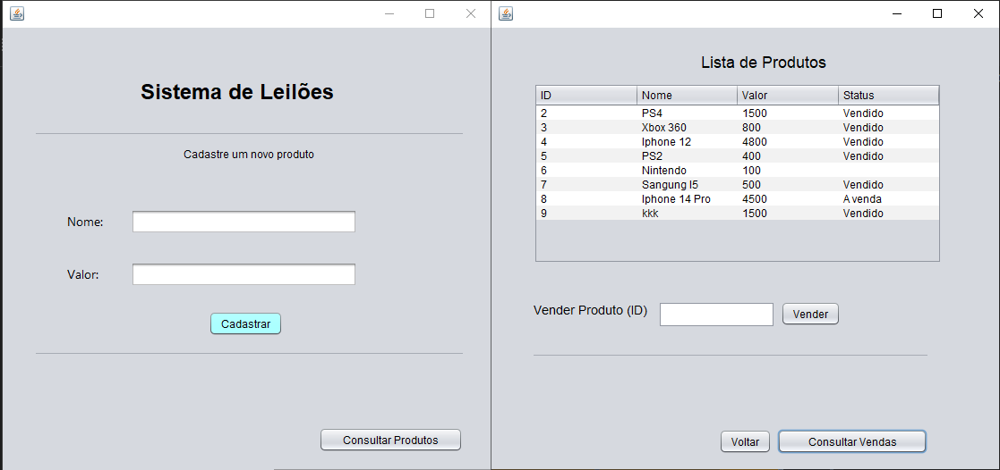
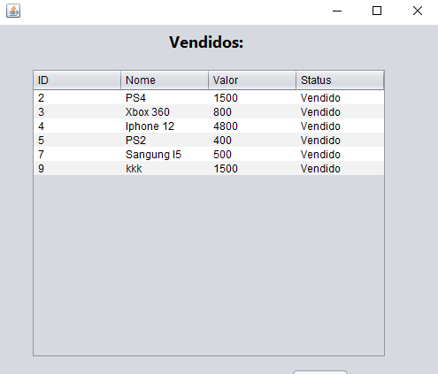

# 🛒 Sistema de Leilões

Este projeto é um sistema de leilões, desenvolvido para oferecer uma experiência acessível e eficiente aos usuários. Ele permite a criação, exibição e participação em leilões de forma intuitiva.

## 🚀 Tecnologias utilizadas

- Java  
- MySQL

## 🖼️ Captura de Tela

### Página de Login

